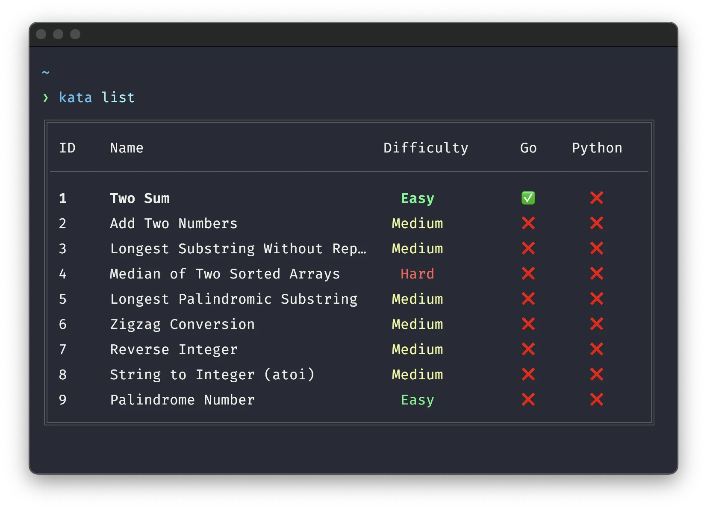

# Kata 🥋

**Kata** a command-line companion for [LeetCode](https://leetcode.com/problemset/) that helps you practice coding problems using TTD.



## Why Kata?

It brings LeetCode practice to your terminal supporting a TDD-first approach. Use your environment, write your tests, submit your solutions, train on the same problems to build muscle memory.

## Installation

### via cURL (macOS/Linux)
```shell
curl -LsSf https://raw.githubusercontent.com/phantompunk/kata/main/scripts/install.sh | sh
```
Review script: [install.sh](https://raw.githubusercontent.com/phantompunk/kata/main/scripts/install.sh) before running.

### via Powershell (Windows)
```shell
irm https://raw.githubusercontent.com/phantompunk/kata/main/scripts/install.ps1 | iex
```
Review script: [install.ps1](https://raw.githubusercontent.com/phantompunk/kata/main/scripts/install.ps1) before running.

### Go

`go install github.com/phantompunk/kata@latest`

### Build (requires Go 1.24+)

```sh
git clone https://github.com/phantompunk/kata.git
cd kata
go build
```

## Quick Start

```bash
# Download and stub a problem
kata get two-sum

# Add your solution
vim ~/katas/two_sum/two_sum.go

# Test your solution
kata test two-sum

# See your progress
kata list
```


## Usage

### Download Problems

```bash
# Stub problem using id
kata get 15

# Stub problem using slug
kata get 3sum     

# Specify language
kata get 3sum --language python

# Open immediately in editor
kata get 3sum -l python --open

# Refresh problem stubs
kata get 3sum --force
```

### Test Solutions

Test your solutions against LeetCode's servers:

```bash
# Test using default language
kata test 3sum

# Test using specific language
kata test 3sum --language
```

!Note: Testing against LeetCode requires authentication

### Submit Solutions

Submit your solutions to LeetCode's servers:

```bash
# Submit using default language
kata submit 3sum

# Submit using specific language
kata submit 3sum --language
```

!Note: Testing against LeetCode requires authentication

### Track Progress

View your completed problems:

```bash
kata list
```

### Authentication

Need to authenticate to test or submit against LeetCode servers.

```bash
# Login using browser cookies (automatically extracts session data)
kata login
```

### Quiz Mode

Get a random problem to solve:

```bash
kata quiz
```

### Configuration

Open settings in your editor:

```bash
kata settings
```

#### Config File

```yaml
# default language
language: go
# open file
openInEditor: false
# track progress for langauges
tracks:
- Go
- Python
# useful for debugging
verbose: false
# workspace for kata files
workspace: ~/Workspace/katas
```

## Contributing

See [contributing](https://github.com/phantompunk/kata/contribute).

## License

MIT License - see [LICENSE](./LICENSE) file for details.

------

**Happy coding! Practice makes permanent.** 🥋

